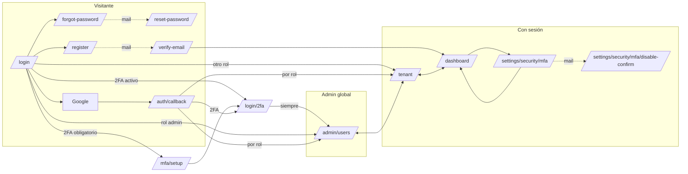

# Mapa de pantallas — frontend de SyntroAuth

> `/sf-analyze` sobre las 14 rutas de `app/`, 2026-09-15, rama `main` @ `2ae1377`. Solo lectura: no se
> escribió código. Insumo para decidir la estructura del producto y para `/sf-plan`.
> **Adaptación del formato:** sin la tabla de paridad `en`/`es` (no hay i18n) y con dos columnas propias
> de este repo: guard y API.
> **HTML servido:** verificado contra `out/` de un build con el toolchain del `Dockerfile` (Node 20,
> pnpm 9) y, para `/login`, contra producción.

## Alcance

`app/**/page.tsx` (15 archivos: 14 rutas + `/`), `app/layout.tsx`, `src/flows/**` (11 flujos),
`src/common/lib/{config,home-path,jwt}.ts`, `src/common/lib/storage/*`,
`src/common/api/clients/*`, `next.config.ts`, `Dockerfile`, `nginx.conf`.
Insumo externo: `syntroAuth/_docs/DISENO_GRUPOS_APLICACIONES.md` §7.

## Render

Todas las rutas siguen el mismo patrón, y **todos los nodos son Client**:

```
app/<ruta>/page.tsx ('use client')          ← 7 líneas: monta un Screen
  └── src/flows/<flujo>/.../components/<X>Screen.tsx   (Client)
        ├── hooks/use<X>Controller.ts        (Client: estado, guard, navegación)
        └── @common/api/clients/*.http.client.ts  → fetch a API_URL (config.ts:7-9)
```

Excepciones: `/` redirige a `/login` en un `useEffect` (`app/page.tsx:6-12`); `/reset-password`,
`/verify-email` y `/settings/security/mfa/disable-confirm` envuelven el Screen en `Suspense` porque leen
`useSearchParams`.

## Pantallas

| Ruta | Screen (`src/flows/…`) | Para quién | Guard | API | HTML servido | Sale a |
|---|---|---|---|---|---|---|
| `/` | — (`app/page.tsx`) | todos | — | — | 51 chars, vacío | `/login` |
| `/login` | `login/…/LoginScreen` | visitante | — | `GET /api/auth/oauth/config`, `GET /api/tenants/by-name/{name}`, `POST /api/auth/login` | 230 chars, h1 "SyntroAuth" | `/forgot-password`, `/register`; al entrar: `homePathForRole` (`useLoginPageController.ts:106`), `/mfa/setup` o `/login/2fa` (`:89-93`) |
| `/login/2fa` | `mfa-login-forced/…/Login2faChallengeScreen` | usuario con 2FA | token temporal (`useLogin2faChallenge.ts:22-24`) | `POST /api/auth/login/2fa` | 144 chars, "Verificación Segura" | **`/admin/users` fijo** (`:41`) |
| `/mfa/setup` | `mfa-login-forced/…/MfaForcedSetupScreen` | usuario de empresa con 2FA obligatorio | token temporal (`useMfaForcedSetup.ts:27-31`) | `POST /api/auth/mfa/setup`, `POST /api/auth/mfa/enable` | 99 chars, "Configurar 2FA" | `/login/2fa` (`:60`) |
| `/auth/callback` | `oauth-callback/…/OAuthCallbackScreen` | visitante que vuelve de Google | parámetros del callback | `POST /api/auth/oauth/login` | 96 chars, "Procesando autenticación..." | `homePathForRole` (`useOAuthCallbackController.ts:74`), `/mfa/setup`, `/login/2fa` (`:63-66`) |
| `/register` | `register/…/RegisterScreen` | visitante | — | `POST /api/tenants/register` | 387 chars, "Crear Cuenta" | `/login` |
| `/forgot-password` | `forgot-password/…/ForgotPasswordScreen` | visitante | — | `POST /api/auth/forgot-password` | 200 chars, "Recuperar contraseña" | `/login` |
| `/reset-password` | `reset-password/…/ResetPasswordScreen` | visitante con link del mail | token en query | `POST /api/auth/reset-password` | 61 chars, "Cargando…" | `/login`, `/forgot-password` |
| `/verify-email` | `verify-email/…/VerifyEmailScreen` | visitante con link del mail | token en query | `POST /api/auth/verify-email/confirm`, `POST /api/account/mfa/confirm-sync` | 63 chars, "Cargando..." | `/login`, `/dashboard` (`:233`) |
| `/dashboard` | `dashboard/…/DashboardScreen` | cualquier usuario con sesión | access token (`useDashboardSession.ts:16-18`) | `POST /api/auth/logout`; lee claims del token | **3590 chars**: "✓ Login Exitoso" + lista de características, **sin login** | `/tenant`, `/settings/security/mfa` (`DashboardScreen.tsx:143,152`), `/login` |
| `/tenant` | `tenant/…/TenantScreen` | dueño de empresa (y admin global) | access token (`useTenantController.ts:47-50`); el rol solo decide links (`:52-53`) | `GET /api/tenants/mine`, `POST /api/tenants`, kit (`GET /api/tenants/{id}/integration-kit`), `GET/POST/PUT/DELETE /api/tenants/{id}/applications` | 74 chars, sin título | `/admin/users` (solo admin, `TenantScreen.tsx:116`), `/dashboard` (`:120`) |
| `/admin/users` | `admin/users/…/AdminUsersScreen` | admin global | access token (`useAdminUsersController.ts:43`); rol ≠ `admin` → `RestrictedAccess` (`AdminUsersScreen.tsx:20-23`) | `GET /api/users`, `POST /api/admin/users/{id}/revoke`, `/api/users/{id}/flags`, `DELETE /api/users/{id}`, step-up `challenge`/`verify` | 220 chars, "Usuarios" | `/tenant` (`:43`), `/login` |
| `/settings/security/mfa` | `mfa-account-settings/…/AccountMfaSettingsScreen` | cualquier usuario con sesión | access token (`useAccountMfaSettingsController.ts:31`) | `POST /api/account/mfa/{setup,confirm-sync,verify,disable/request}` | 249 chars, "Configurar 2FA (TOTP)" | `/dashboard` (`:328,418,509`) |
| `/settings/security/mfa/disable-confirm` | `mfa-account-settings/…/MfaDisableConfirmScreen` | usuario con link del mail | token en query | `POST /api/auth/mfa/disable/confirm` | 61 chars, "Cargando…" | `/login` (`:70`), `/settings/security/mfa` (`:91`) |

## Qué ve cada tipo de usuario



- **Visitante:** login por empresa (campo "Empresa" + email + password, `LoginCredentialForm.tsx:42-58`) o
  Google; registro de empresa y dueño; recuperación de password.
- **Dueño de empresa:** entra a `/tenant` — nombre de la empresa, descarga del kit (zip, md, llms;
  `TenantScreen.tsx:85-103`) y **panel "Aplicaciones"** debajo (`ApplicationsPanel`, `:109`). Llega a
  `/dashboard` y a la configuración de 2FA. Si tiene 2FA, hoy termina en `/admin/users` con acceso
  restringido (ver Hallazgos).
- **Admin global:** entra a `/admin/users` — **listado "Usuarios"** con revocar, flags y borrar, cada acción
  detrás de step-up 2FA. Navega a `/tenant`.

## Bordes

| Archivo | Server/Client | ¿Su texto llega al HTML? | ¿Quién lo importa? |
|---|---|---|---|
| `app/**/page.tsx` (15) | Client | Sí, el estado inicial (export estático) | Next (rutas) |
| `app/layout.tsx` | Server | Sí: `title` y `description` | Next |
| `src/flows/*/…/*Screen.tsx` | Client | Estado inicial; lo que depende del token o de la API, no | su `page.tsx` |
| `…/ResetPasswordScreen`, `VerifyEmailScreen`, `MfaDisableConfirmScreen` | Client en `Suspense` | No: se sirve el fallback "Cargando…" | su `page.tsx` |
| `src/flows/dashboard/general/data/security-features.data.ts` | módulo | **Sí, completo** (en `/dashboard.html`) | `DashboardScreen` |
| `src/common/api/clients/users.http.client.ts` | módulo | — | **nadie** |
| `src/common/api/mappers/register-result.mapper.ts` | módulo | — | **nadie** |

Búsqueda de referencias: `src/` y `app/`, archivos `.ts`/`.tsx`, por import de módulo y por nombre de export.

## Origen del copy

Todo el texto está **escrito en los componentes**, en español; no hay archivos de idioma ni i18n
(verificado: sin dependencias de i18n en `package.json`, `lang="es"` fijo en `app/layout.tsx:26`). El único
copy con fuente propia es la lista de características (`security-features.data.ts`) y la marca
(`src/common/lib/brand.ts`).

## Riesgos

- **Refresh solo por `refreshAccessToken`** → llamar a `/api/auth/refresh` desde otro lado (o desde dos
  pestañas a la vez) dispara la detección de robo del backend y cierra todas las sesiones.
- **Guards solo de UI** → mover una pantalla "protegida" no la protege: su HTML estático es público. Nada
  sensible puede ir en el estado inicial de una pantalla.
- **Destino después de entrar** → cambiar "a dónde va cada rol" hoy exige tocar cinco lugares
  (tabla de arriba); el rediseño tiene que dejar uno solo.
- **Export estático** → headers, redirects o protección por ruta no se pueden hacer en Next; van en
  `nginx.conf`.
- **Grupos de aplicaciones** → `/tenant` cambia de forma (grilla de grupos → detalle → apps) y aparece un
  secreto que se muestra una sola vez: la pantalla no puede guardarlo ni volver a mostrarlo.

## Hallazgos

Clasificados y fichados en `docs/TODO.md`:

- **[Bug]** 2FA → `/admin/users` para cualquier rol (`useLogin2faChallenge.ts:41`).
- **[Bug]** Destinos después de entrar inconsistentes (`/dashboard` desde verify-email y 2FA).
- **[Bug]** La lista de características promete capacidades que el backend no tiene, y se sirve sin login.
- **[Bug]** Códigos de recuperación mostrados que el backend no acepta (M13).
- **[Bug]** Lint en rojo en `main`, y el `Dockerfile` no lo corre.
- **[Bug]** Sin headers de seguridad en nginx → `/sf-sec`.
- **[Gap]** Refresh sin coordinar entre pestañas; sin CI ni tests; toolchain sin fijar; rutas inexistentes con 200.
- **[Sugerencia]** Restos de demo en el copy; código muerto.

## Insumo para el rediseño (no es estado actual)

- **Decisiones acordadas el 2026-09-15:** darle estructura formal; después de entrar, ir directo al
  listado; el dashboard pasa a ser una pantalla de características.
- **`DISENO_GRUPOS_APLICACIONES.md` §7:** `/tenant` → grilla de grupos (nombre, `key_id` copiable, cantidad
  de apps, estado, "Nuevo grupo") → modal con el `key_secret` una sola vez → detalle del grupo con la
  grilla de aplicaciones ("Nueva aplicación"), credenciales (rotar, revocar) y el kit como acción secundaria.
  Se construye después del corte 1 del backend (grupos) y se completa con el 2 (secretos).
